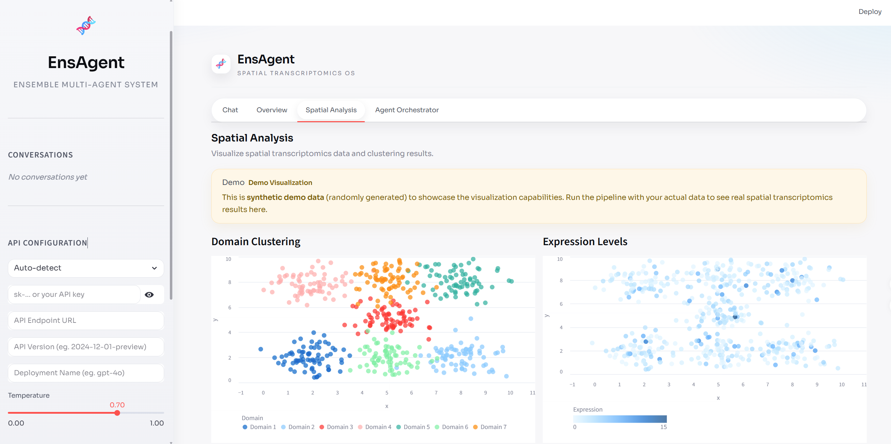

# EnsAgent

Ensemble multi-agent framework for spatial transcriptomics analysis.  
Integrates eight clustering methods, LLM-based evaluation, consensus label selection, and multi-agent domain annotation into a single reproducible pipeline.



## Pipeline Overview

| Stage | Module | Description |
|-------|--------|-------------|
| **A** Tool-Runner | `Tool-runner/orchestrator.py` | Execute 8 spatial clustering methods, align labels, generate downstream outputs |
| **B** Scoring | `scoring/scoring.py` | LLM-driven evaluation of each method per domain, build consensus matrices |
| **C** BEST Builder | `ensemble/build_best.py` | Select optimal domain labels from scores/labels matrices, produce `BEST_*` files |
| **D** Annotation | `annotation/annotation_multiagent/` | Multi-agent (VLM + Peer + Critic) annotation of spatial domains |

## Supported Clustering Methods

| Method | Env | Reference |
|--------|-----|-----------|
| IRIS | R | [Nat Commun 2024](https://doi.org/10.1038/s41467-024-46638-4) |
| BASS | R | [Nat Biotechnol 2022](https://doi.org/10.1038/s41587-022-01536-2) |
| DR-SC | R | [Nat Commun 2023](https://doi.org/10.1038/s41467-023-35947-w) |
| BayesSpace | R | [Nat Biotechnol 2021](https://doi.org/10.1038/s41587-021-00935-2) |
| SEDR | PY | [Nat Commun 2022](https://doi.org/10.1038/s41467-022-29439-6) |
| GraphST | PY | [Nat Commun 2023](https://doi.org/10.1038/s41467-023-36796-3) |
| STAGATE | PY | [Nat Commun 2022](https://doi.org/10.1038/s41467-022-29439-6) |
| stLearn | PY2 | [bioRxiv 2020](https://doi.org/10.1101/2020.05.31.125658) |

## Quick Start

### 1. Install Miniforge (recommended)

Download from <https://github.com/conda-forge/miniforge/releases> and install.  
Miniforge ships with `mamba`, which is significantly faster than `conda`.

### 2. Create Environments

```bash
# Main environment (LLM libs, Streamlit, etc.)
mamba env create -f environment.yml
mamba activate ensagent

# Tool-runner environments (clustering methods)
mamba env create -f envs/R_environment.yml    # R: IRIS, BASS, DR-SC, BayesSpace
mamba env create -f envs/PY_environment.yml   # PY: SEDR, GraphST, STAGATE
mamba env create -f envs/PY2_environment.yml  # PY2: stLearn
```

> If `environment.yml` is slow to solve, try `environment.fast.yml` instead.

### 3. Configure

```bash
cp pipeline_config.example.yaml pipeline_config.yaml
```

Edit `pipeline_config.yaml` -- at minimum set `data_path` and `sample_id`:

```yaml
data_path: "Tool-runner/151507"
sample_id: "DLPFC_151507"
tool_output_dir: "output/tool_runner/DLPFC_151507"
best_output_dir: "output/best/DLPFC_151507"
best_truth_file: "Tool-runner/151507/151507_truth.txt"
```

`streamlit_app` Settings writes API values and data/sample defaults to `pipeline_config.yaml`.
On first load, Settings auto-detects `data_path` and `sample_id` in this order:
1. `pipeline_config.yaml`
2. `Tool-runner/configs/*.yaml`
3. repo scan for Visium markers (`filtered_feature_bc_matrix.h5` + `spatial/`)
`api_config.py` is deprecated and kept only for backward-compatible fallback.

Set Azure OpenAI credentials via environment variables:

```bash
export AZURE_OPENAI_KEY="sk-..."
export AZURE_OPENAI_ENDPOINT="https://your-resource.openai.azure.com/"
export AZURE_OPENAI_DEPLOYMENT="gpt-4o"
export AZURE_OPENAI_API_VERSION="2024-12-01-preview"
```

### 4. Run

```bash
# Full pipeline -- reads pipeline_config.yaml automatically
python endtoend.py

# Override a single parameter via CLI
python endtoend.py --n_clusters 5
```

## Project Structure

```
EnsAgent/
├── endtoend.py                        # CLI pipeline entry point
├── pipeline_config.example.yaml       # Config template
├── pipeline_config.yaml               # Your local config (git-ignored)
│
├── ensagent_tools/                    # Unified tool layer
│   ├── registry.py                    #   JSON schemas + dispatch
│   ├── config_manager.py              #   Load / save pipeline_config.yaml
│   ├── env_manager.py                 #   check_envs / setup_envs
│   ├── tool_runner.py                 #   Stage A wrapper
│   ├── scoring.py                     #   Stage B wrapper
│   ├── best_builder.py                #   Stage C wrapper
│   ├── annotation.py                  #   Stage D wrapper
│   └── pipeline.py                    #   Full A→B→C→D orchestration
│
├── Tool-runner/
│   ├── orchestrator.py                # Clustering orchestrator (mamba run)
│   ├── tools/                         # 4 R + 4 Python clustering scripts
│   ├── postprocess/                   # align_labels, generate_degs, etc.
│   └── configs/                       # Orchestrator config presets used by `--config`
│
├── scoring/                           # LLM scoring + matrix builder
├── ensemble/                          # BEST builder (build_best.py)
├── annotation/                        # Multi-agent annotation
├── envs/                              # R / PY / PY2 environment YAMLs
│
├── ensagent_agent/                    # CLI LLM chat agent
│   └── chat.py
│
├── streamlit_app/                     # Web UI
│   └── main.py
│
└── tests/                             # Unit tests
```

## Running Individual Stages

```bash
# Stage A only: Tool-runner
python Tool-runner/orchestrator.py --config Tool-runner/configs/DLPFC_151507.yaml

# Stage B only: Scoring (reads from scoring/input/)
cd scoring && python scoring.py

# Stage B with visual module disabled
cd scoring && python scoring.py --vlm_off

# Stage C only: BEST builder
python ensemble/build_best.py \
  --sample_id DLPFC_151507 \
  --scores_matrix scoring/output/consensus/scores_matrix.csv \
  --labels_matrix scoring/output/consensus/labels_matrix.csv \
  --spot_template scoring/input/IRIS_DLPFC_151507_spot.csv \
  --visium_dir "D:/path/to/data/151507" \
  --output_dir output/best/DLPFC_151507

# Stage D only: Multi-agent annotation
python scoring/scoring.py \
  --annotation_multiagent \
  --annotation_data_dir output/best/DLPFC_151507 \
  --annotation_sample_id DLPFC_151507
```

## Streamlit UI

```bash
mamba activate ensagent
streamlit run streamlit_app/main.py
```

Features:
- **Chat** -- converse with EnsAgent to run pipeline stages, check config, manage environments
- **Conversation history** -- sidebar shows recent chats, auto-saved to `chat_history/` (legacy `.chat_history/` is auto-migrated)
- **Export** -- use the `...` menu on each history item to export JSON or delete the conversation
- **Spatial Analysis** -- visualize clustering results
- **Agent Orchestrator** -- monitor sub-agent status
- **Settings** -- configure API credentials and pipeline parameters
  - API credentials are persisted in `pipeline_config.yaml` (git-ignored)
  - Data Path / Sample ID are auto-detected on page load when empty

## CLI Chat Agent

```bash
mamba activate ensagent
python -m ensagent_agent.chat
```

The CLI agent uses the same tool registry (`ensagent_tools`) and understands the full pipeline context. It can check environments, run stages, and update `pipeline_config.yaml` via natural language.

## Agent Tools API

All pipeline capabilities are exposed as callable tools in `ensagent_tools/`:

```python
from ensagent_tools import load_config, execute_tool

cfg = load_config()
result = execute_tool("run_tool_runner", {"data_path": "...", "sample_id": "..."}, cfg)
```

Available tools: `check_envs`, `setup_envs`, `run_tool_runner`, `run_scoring`, `run_best_builder`, `run_annotation`, `run_end_to_end`, `show_config`, `set_config`.

Each tool also has an OpenAI function-calling JSON schema accessible via `ensagent_tools.TOOL_SCHEMAS`.

## Input Data Format

Organize 10X Visium data as:

```
data_directory/
├── filtered_feature_bc_matrix.h5     # Required
├── metadata.tsv                       # Optional (reference annotations)
├── spatial/                           # Required
│   ├── tissue_hires_image.png
│   ├── tissue_lowres_image.png
│   ├── scalefactors_json.json
│   └── tissue_positions_list.csv
└── RData/                             # Required for IRIS / BASS
    ├── countList_spatial_LIBD.RDS
    ├── scRef_input_mainExample.RDS
    └── spatialLIBD_p1.RData
```

## Output Structure

After a full pipeline run:

```
output/
├── tool_runner/<sample_id>/
│   ├── domains/           # Raw clustering CSVs (8 methods)
│   ├── spot/              # Spot-level data with coordinates
│   ├── DEGs/              # Differential expression results
│   ├── PATHWAY/           # Pathway enrichment results
│   ├── PICTURES/          # Spatial visualizations
│   └── tool_runner_report.json
│
├── best/<sample_id>/
│   ├── BEST_<sample_id>_spot.csv
│   ├── BEST_<sample_id>_DEGs.csv
│   ├── BEST_<sample_id>_PATHWAY.csv
│   └── <sample_id>_result.png
│
└── (scoring outputs under scoring/output/)
```

## Configuration Reference

See `pipeline_config.example.yaml` for all available options with comments.

Key parameters:

| Parameter | Default | Description |
|-----------|---------|-------------|
| `data_path` | (required) | Path to Visium data directory |
| `sample_id` | (required) | Sample identifier |
| `api_provider` | `""` | UI-selected provider in Streamlit Settings |
| `api_endpoint` | `""` | API base endpoint |
| `api_model` | `""` | Canonical model/deployment name across providers |
| `api_deployment` | `""` | Model/deployment name |
| `n_clusters` | 7 | Number of spatial domains |
| `methods` | all 8 | Which clustering methods to run |
| `conda_exe` | `mamba` | Package manager executable |
| `run_best` | `true` | Run BEST builder after scoring |
| `run_annotation_multiagent` | `true` | Run multi-agent annotation |

## Troubleshooting

**Environment creation fails**: Run `mamba clean --all` then retry.

**A clustering method fails**: Check `output/tool_runner/<sample_id>/tool_runner_report.json`. The pipeline continues as long as `min_success` methods succeed (default: 5).

**Memory errors**: Reduce the number of methods or increase system RAM.

**API authentication errors**: Verify `AZURE_OPENAI_KEY` and `AZURE_OPENAI_ENDPOINT` env vars are set correctly.

## System Requirements

- 16 GB RAM minimum (32 GB recommended)
- Python 3.10+, R 4.2+
- Miniforge / Mamba (recommended) or Conda
- GPU optional (accelerates SEDR, GraphST, STAGATE)
