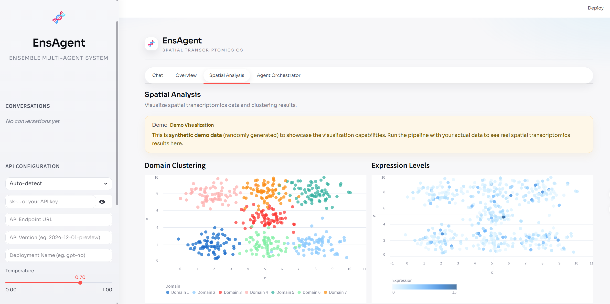

# EnsAgent Overview (Tool-runner → Scoring → BEST → Annotation)



1) **Tool-runner**: runs multiple clustering tools plus alignment and downstream analyses  
2) **Scoring**: LLM scoring and aggregation, builds consensus matrices  
3) **BEST Builder**: generates `BEST_<sample_id>_{spot,DEGs,PATHWAY}.csv` and result image  
4) **Annotation Multi-agent**: multi-agent spatial domain annotation  

## Project Structure

- `Tool-runner/`: multi-tool clustering orchestration and downstream analysis  
- `scoring/`: scoring, matrix building, optional annotation entry  
- `ensemble/`: BEST builder  
- `annotation/`: multi-agent annotation implementation  
- `streamlit_app/`: frontend UI  
- `ensagent_agent/`: conversational local assistant  
- `envs/`: R / PY / PY2 environment definitions  

## Main Entrypoints

- End-to-end: `endtoend.py`  
- UI: `streamlit_app/main.py`  
- Tool-runner: `Tool-runner/orchestrator.py`  
- Scoring: `scoring/scoring.py`  
- BEST: `ensemble/build_best.py`  
- Annotation: `annotation/annotation_multiagent/orchestrator.py`  
- Assistant: `python -m ensagent_agent.chat`  

## Environment Setup

### Tool-runner Environments (R / PY / PY2)

See:

- `Tool-runner/SETUP_GUIDE.md`
- `envs/*.yml`

### Main Environment (Recommended)

**Option A: Conda (Recommended)**

```bash
# Windows PowerShell:
$env:CONDA_CHANNELS="conda-forge"; conda env create -f environment.yml --solver=libmamba; $env:CONDA_CHANNELS=$null
conda activate ensagent

# Or Linux/Mac:
CONDA_CHANNELS=conda-forge conda env create -f environment.yml --solver=libmamba
conda activate ensagent
```

If conda solving is slow or OOM, use:

```bash
conda env create -f environment.fast.yml --solver=libmamba
conda activate ensagent
```

**Option B: Minimal conda + pip**

```bash
conda create -n ensagent python=3.10 pip -y
conda activate ensagent
pip install -r scoring/requirements.txt
pip install -r streamlit_app/requirements.txt
```

Azure OpenAI environment variables (or `scoring/config.py` legacy loader):

- `AZURE_OPENAI_KEY`
- `AZURE_OPENAI_ENDPOINT`
- `AZURE_OPENAI_DEPLOYMENT`
- `AZURE_OPENAI_API_VERSION`

## Quick Start

### End-to-end

```bash
python endtoend.py --data_path "<VISIUM_DIR>" --sample_id "DLPFC_151507" --run_best --run_annotation_multiagent
```

### Tool-runner only

```bash
python Tool-runner/orchestrator.py --config Tool-runner/configs/DLPFC_151507.yaml
```

### Scoring only

```bash
python scoring/scoring.py
```

### Annotation only (with existing BEST_* files)

```bash
python scoring/scoring.py --annotation_multiagent --annotation_data_dir "output/best/DLPFC_151507" --annotation_sample_id "DLPFC_151507"
```

### Streamlit UI

```bash
conda activate ensagent
streamlit run streamlit_app/main.py
```

## Outputs

Annotation expects the following files under `--annotation_data_dir`:

- `BEST_<sample_id>_spot.csv`
- `BEST_<sample_id>_DEGs.csv`
- `BEST_<sample_id>_PATHWAY.csv`
- `<sample_id>_result.png`
