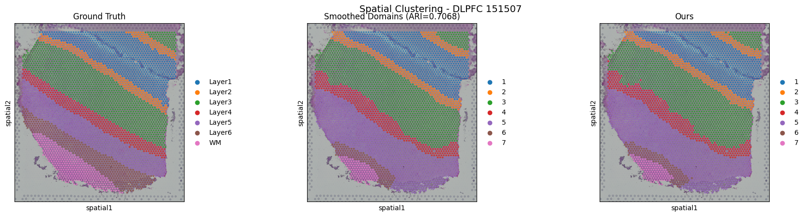

# EnsAgent

<div align="center">
  
  <br>
  <br>
  <a href="https://github.com/keviccz/ensAgent/raw/main/Readme_example/Frontend-use.mp4">
    
  </a>
  <br>
  <a href="https://github.com/keviccz/ensAgent/raw/main/Readme_example/Frontend-use.mp4">Watch the frontend demo video</a>
</div>

EnsAgent is an ensemble multi-agent framework for spatial transcriptomics analysis on 10x Visium data. It runs eight spatial clustering methods, scores domain-level evidence with LLM/VLM agents, builds a consensus BEST result, and annotates spatial domains through a multi-agent workflow.

## Highlights

- Eight wrapped spatial clustering methods: IRIS, BASS, DR-SC, BayesSpace, SEDR, GraphST, STAGATE, and stLearn.
- One supported local app stack: FastAPI backend plus Next.js frontend, launched with `python start.py`.
- Reproducible stage outputs for clustering labels, spatial plots, DEGs, pathway summaries, scores matrices, BEST labels, and final annotations.
- Provider configuration through `pipeline_config.yaml` or environment variables, with Azure-compatible aliases still supported.

## Quick Start

### 1. Create Environments

```bash
# Main environment: API, LLM runtime, and shared tooling
mamba env create -f environment.yml
mamba activate ensagent
python -m pip install -r requirements.txt

# Tool-runner environments
mamba env create -f envs/R_environment.yml    # IRIS, BASS, DR-SC, BayesSpace
mamba env create -f envs/PY_environment.yml   # SEDR, GraphST, STAGATE
mamba env create -f envs/PY2_environment.yml  # stLearn
```

### 2. Configure

```bash
cp pipeline_config.example.yaml pipeline_config.yaml
```

Edit `pipeline_config.yaml` and set at least:

```yaml
data_path: "Tool-runner/151507"
sample_id: "DLPFC_151507"
n_clusters: 7
```

Recommended provider environment variables:

```bash
export ENSAGENT_API_PROVIDER="openai"
export ENSAGENT_API_KEY="sk-..."
export ENSAGENT_API_MODEL="gpt-4o"
export ENSAGENT_API_ENDPOINT=""
export ENSAGENT_API_VERSION=""
```

Azure aliases are also supported: `AZURE_OPENAI_KEY`, `AZURE_OPENAI_ENDPOINT`, `AZURE_OPENAI_DEPLOYMENT`, and `AZURE_OPENAI_API_VERSION`.

### 3. Run

```bash
# Local web app
mamba activate ensagent
python start.py
```

The launcher starts:

- FastAPI backend: `http://localhost:8000`
- Next.js frontend: `http://localhost:3000`

Run the full pipeline from the command line:

```bash
python endtoend.py
python endtoend.py --data_path "<VISIUM_DIR>" --sample_id "DLPFC_151507" --n_clusters 7
```

Run focused checks:

```bash
python tools/health_check.py
python -m unittest discover -s tests -v
cd frontend && npm run build
```

## Method Code And Data Availability

EnsAgent wraps public method implementations. The table below lists the upstream implementation and the input data expected by the current wrapper.

| Method | Upstream availability | Data expected by EnsAgent |
| ------ | --------------------- | ------------------------- |
| IRIS | [GitHub: YingMa0107/IRIS](https://github.com/YingMa0107/IRIS) | `RData/countList_spatial_LIBD.RDS` plus `RData/scRef_input_mainExample.RDS` for spatial count/location data and matched scRNA-seq reference |
| BASS | [GitHub: zhengli09/BASS](https://github.com/zhengli09/BASS) | `RData/spatialLIBD_p1.RData` containing BASS-ready count and coordinate lists |
| DR-SC | [GitHub: feiyoung/DR.SC](https://github.com/feiyoung/DR.SC) | 10x Visium directory loadable with Seurat `Load10X_Spatial` |
| BayesSpace | [Bioconductor](https://bioconductor.org/packages/release/bioc/html/BayesSpace.html), [GitHub: edward130603/BayesSpace](https://github.com/edward130603/BayesSpace) | 10x Visium directory loadable with BayesSpace `readVisium` |
| SEDR | [GitHub: JinmiaoChenLab/SEDR](https://github.com/JinmiaoChenLab/SEDR) | 10x Visium directory loadable with Scanpy `read_visium` |
| GraphST | [GitHub: JinmiaoChenLab/GraphST](https://github.com/JinmiaoChenLab/GraphST) | 10x Visium directory loadable with Scanpy `read_visium` |
| STAGATE | [GitHub: QIFEIDKN/STAGATE_pyG](https://github.com/QIFEIDKN/STAGATE_pyG) | 10x Visium directory loadable with Scanpy `read_visium` |
| stLearn | [GitHub: BiomedicalMachineLearning/stLearn](https://github.com/BiomedicalMachineLearning/stLearn) | 10x Visium directory with `spatial/` image files, loadable with stLearn/Scanpy Visium readers |

## Input Data

For a standard 10x Visium sample:

```text
data_directory/
├── filtered_feature_bc_matrix.h5
├── metadata.tsv
├── spatial/
│   ├── tissue_hires_image.png
│   ├── tissue_lowres_image.png
│   ├── scalefactors_json.json
│   └── tissue_positions_list.csv
└── RData/
    ├── countList_spatial_LIBD.RDS
    ├── scRef_input_mainExample.RDS
    └── spatialLIBD_p1.RData
```

`RData/` is required only for wrappers that need the original method-specific R objects, especially IRIS and BASS. The other methods read the Visium directory directly.

## Outputs

A full run writes sample-scoped outputs under:

```text
output/
├── tool_runner/<sample_id>/
│   ├── domains/
│   ├── spot/
│   ├── DEGs/
│   ├── PATHWAY/
│   ├── PICTURES/
│   └── tool_runner_report.json
├── best/<sample_id>/
│   ├── BEST_<sample_id>_spot.csv
│   ├── BEST_<sample_id>_DEGs.csv
│   ├── BEST_<sample_id>_PATHWAY.csv
│   ├── <sample_id>_result.png
│   └── annotation_output/domain_annotations.json
└── scoring/output/<sample_id>/
```

## Core Commands

```bash
# Tool-Runner only
python Tool-runner/orchestrator.py --config Tool-runner/configs/DLPFC_151507.yaml

# Scoring only
cd scoring && python scoring.py

# BEST builder only
python ensemble/build_best.py \
  --sample_id DLPFC_151507 \
  --scores_matrix scoring/output/DLPFC_151507/consensus/scores_matrix.csv \
  --labels_matrix scoring/output/DLPFC_151507/consensus/labels_matrix.csv \
  --spot_template scoring/input/IRIS_DLPFC_151507_spot.csv \
  --visium_dir "D:/path/to/data/151507" \
  --output_dir output/best/DLPFC_151507
```

## Requirements

- Python 3.10+
- R 4.2+
- Miniforge/Mamba or Conda
- 16 GB RAM minimum, 32 GB recommended
- GPU optional for SEDR, GraphST, and STAGATE
