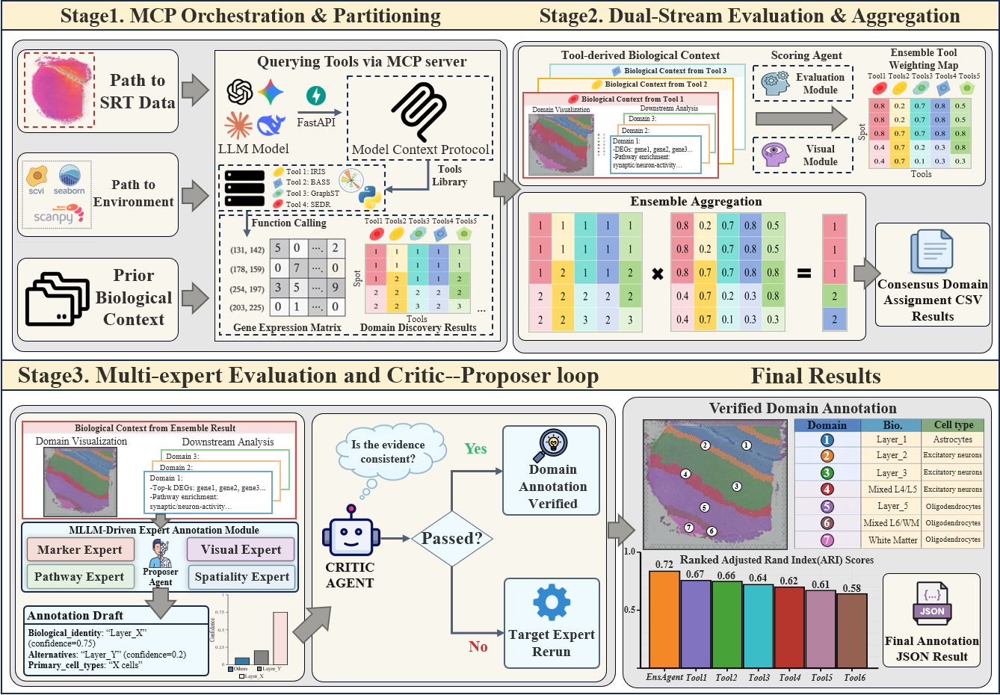

# EnsAgent

<div align="center">
  <h3>面向空间转录组的集成式多智能体分析框架</h3>
  <p>
    <a href="README.md">English</a> | <b>中文</b>
  </p>
  <p>
    
    
    
    
    
    
    
  </p>
  <p>
    <a href="#快速开始">快速开始</a> ·
    <a href="#方法代码与数据可用性">方法与数据</a> ·
    <a href="#核心命令">命令</a> ·
    <a href="#演示视频">演示视频</a>
  </p>
  
  <br>
  <br>
  <a id="演示视频"></a>
  <video src="Readme_example/Frontend-use.mp4" controls muted width="720"></video>
</div>


https://github.com/user-attachments/assets/4b26e417-85c9-4d6c-8dc2-84326afd8a17


EnsAgent 是一个面向 10x Visium 空间转录组数据的集成式多智能体分析框架。它统一运行多种空间转录组分析工具，使用 LLM/VLM 智能体评估 domain 级证据，构建 BEST 共识结果，并通过多智能体流程完成空间 domain 注释。

## 项目亮点

- **多方法空间域集成**：统一调度多种空间域识别工具，并基于域级可靠性评分生成加权共识结果。
- **双流质量评估机制**：结合分子证据、空间形态统计和视觉语言模型判断，对候选空间域进行可解释评分。
- **Expert–Proposer–Critic 注释框架**：通过多专家证据评估、候选标签整合和一致性审查，生成更稳健的空间域注释。
- **置信度感知输出**：除最终标签外，同时提供置信度、候选标签排序、专家支持分布和证据链。
- **跨平台适用性**：支持 Visium、Stereo-seq、MERFISH 等不同空间转录组数据类型。

## 快速开始

### 1. 创建环境

```bash
mamba env create -f environment.yml
mamba activate ensagent
python -m pip install -r requirements.txt

mamba env create -f envs/R_environment.yml
mamba env create -f envs/PY_environment.yml
mamba env create -f envs/PY2_environment.yml
```

### 2. 配置

```bash
cp pipeline_config.example.yaml pipeline_config.yaml
```

编辑 `pipeline_config.yaml`，至少设置以下字段：

```yaml
data_path: "Tool-runner/151507"
sample_id: "DLPFC_151507"
n_clusters: 7
```

推荐使用以下 provider 环境变量：

```bash
export ENSAGENT_API_PROVIDER="openai"
export ENSAGENT_API_KEY="sk-..."
export ENSAGENT_API_MODEL="gpt-4o"
```

同时支持 Azure 兼容别名：`AZURE_OPENAI_KEY`、`AZURE_OPENAI_ENDPOINT`、`AZURE_OPENAI_DEPLOYMENT` 和 `AZURE_OPENAI_API_VERSION`。

### 3. 运行

```bash
python start.py
```

启动器会同时启动：

- FastAPI 后端：`http://localhost:8000`
- Next.js 前端：`http://localhost:3000`

也可以通过命令行运行完整 pipeline：

```bash
python endtoend.py
python endtoend.py --data_path "<VISIUM_DIR>" --sample_id "DLPFC_151507" --n_clusters 7
```

## 方法代码与数据可用性

EnsAgent 封装了公开的空间转录组方法实现。下表列出上游实现地址，以及当前 wrapper 期望的输入数据。

| 方法 | 上游可用性 | EnsAgent 期望的数据 |
| ---- | ---------- | ------------------- |
| IRIS | [GitHub: YingMa0107/IRIS](https://github.com/YingMa0107/IRIS) | `RData/countList_spatial_LIBD.RDS` 和 `RData/scRef_input_mainExample.RDS`，用于空间 count/location 数据和匹配的 scRNA-seq reference |
| BASS | [GitHub: zhengli09/BASS](https://github.com/zhengli09/BASS) | `RData/spatialLIBD_p1.RData`，包含 BASS 可直接读取的 count 和 coordinate lists |
| DR-SC | [GitHub: feiyoung/DR.SC](https://github.com/feiyoung/DR.SC) | 可由 Seurat `Load10X_Spatial` 读取的 10x Visium 目录 |
| BayesSpace | [Bioconductor](https://bioconductor.org/packages/release/bioc/html/BayesSpace.html), [GitHub: edward130603/BayesSpace](https://github.com/edward130603/BayesSpace) | 可由 BayesSpace `readVisium` 读取的 10x Visium 目录 |
| SEDR | [GitHub: JinmiaoChenLab/SEDR](https://github.com/JinmiaoChenLab/SEDR) | 可由 Scanpy `read_visium` 读取的 10x Visium 目录 |
| GraphST | [GitHub: JinmiaoChenLab/GraphST](https://github.com/JinmiaoChenLab/GraphST) | 可由 Scanpy `read_visium` 读取的 10x Visium 目录 |
| STAGATE | [GitHub: QIFEIDKN/STAGATE_pyG](https://github.com/QIFEIDKN/STAGATE_pyG) | 可由 Scanpy `read_visium` 读取的 10x Visium 目录 |
| stLearn | [GitHub: BiomedicalMachineLearning/stLearn](https://github.com/BiomedicalMachineLearning/stLearn) | 带有 `spatial/` 图像文件的 10x Visium 目录，可由 stLearn/Scanpy Visium reader 读取 |

## 输入数据

```text
data_directory/
├── filtered_feature_bc_matrix.h5
├── metadata.tsv
├── spatial/
│   ├── tissue_hires_image.png
│   ├── tissue_lowres_image.png
│   ├── scalefactors_json.json
│   └── tissue_positions_list.csv
└── RData/
    ├── countList_spatial_LIBD.RDS
    ├── scRef_input_mainExample.RDS
    └── spatialLIBD_p1.RData
```

`RData/` 只对需要原始方法特定 R 对象的 wrapper 必需，尤其是 IRIS 和 BASS。其他方法主要直接读取 Visium 目录。

## 输出结果

```text
output/
├── tool_runner/<sample_id>/
├── best/<sample_id>/
└── scoring/output/<sample_id>/
```

关键输出文件包括 `BEST_<sample_id>_spot.csv`、`BEST_<sample_id>_DEGs.csv`、`BEST_<sample_id>_PATHWAY.csv`、`<sample_id>_result.png` 和 `annotation_output/domain_annotations.json`。

## 核心命令

```bash
python Tool-runner/orchestrator.py --config Tool-runner/configs/DLPFC_151507.yaml
cd scoring && python scoring.py
python tools/health_check.py
python -m unittest discover -s tests -v
cd frontend && npm run build
```

## 环境要求

- Python 3.10+
- R 4.2+
- Miniforge/Mamba 或 Conda
- 最低 16 GB RAM；推荐 32 GB
- SEDR、GraphST 和 STAGATE 可选使用 GPU
